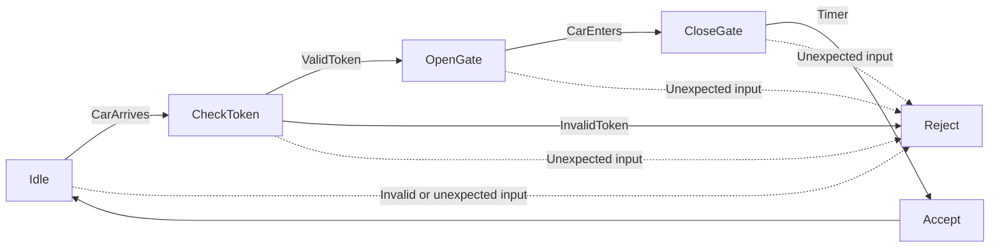

# Parking Lot Entry Validation System Using DFA

A parking lot entry control system modeled with a **Deterministic Finite Automaton (DFA)**. The project validates each vehicle action in a fixed sequence so that only valid entry attempts are accepted. Invalid tokens, out-of-order events, and entries beyond the parking capacity are rejected.

## Project Overview

The system represents the parking process as a set of states and deterministic transitions. For every state and input, there is exactly one next state. This makes the entry workflow predictable, traceable, and resistant to invalid event sequences.

A successful entry follows this sequence:

```text
CarArrives -> ValidToken -> CarEnters -> Timer -> Accept
```

After acceptance, the system returns to the `Idle` state and waits for the next vehicle.

## Features

- Validates vehicle entry using deterministic state transitions
- Accepts manual vehicle IDs such as license plate numbers
- Verifies valid and invalid parking tokens
- Rejects incorrect or out-of-order actions
- Prevents new entries when the parking lot reaches maximum capacity
- Tracks the exact IDs of vehicles currently inside the parking lot
- Removes a specific vehicle through a controlled exit operation
- Logs state transitions, vehicle actions, and system responses with timestamps
- Reports current occupancy, remaining spaces, accepted entries, and rejected attempts

## DFA Model

### States

| State | Purpose |
| --- | --- |
| `Idle` | Waits for a vehicle to arrive |
| `CheckToken` | Validates the submitted token |
| `OpenGate` | Opens the gate after successful validation |
| `CloseGate` | Closes the gate after the vehicle enters |
| `Accept` | Confirms a successful entry sequence |
| `Reject` | Handles invalid tokens, invalid actions, and incorrect sequences |

### Input Symbols

- `CarArrives`
- `ValidToken`
- `InvalidToken`
- `CarEnters`
- `Timer`
- `CarExits`

Any input received in an unexpected state moves the process to `Reject`. The failed attempt is logged and included in the rejection statistics.

## System Flow



## Validation Scenarios

### Valid Entry

```text
CarArrives -> ValidToken -> CarEnters -> Timer
Result: Accepted
```

### Invalid Event Order

```text
CarArrives -> CarEnters
Result: Rejected
```

### Invalid Token

```text
CarArrives -> InvalidToken
Result: Rejected
```

### Capacity Limit

When the parking lot is full, additional `CarArrives` requests are rejected until a vehicle exits and a space becomes available.

## Project Outcome

The project demonstrates how a DFA can control a real-world event-driven process. It preserves deterministic behavior, rejects invalid sequences, tracks parking activity, and combines formal automata concepts with practical features such as capacity management, vehicle identification, logging, and reporting.
